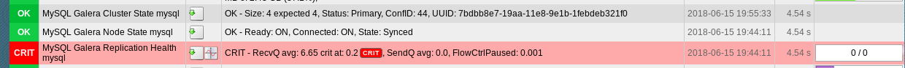
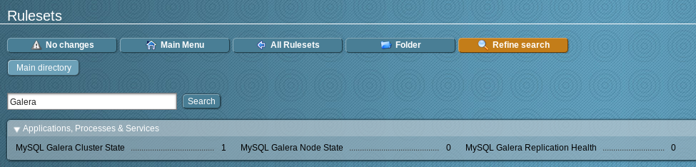
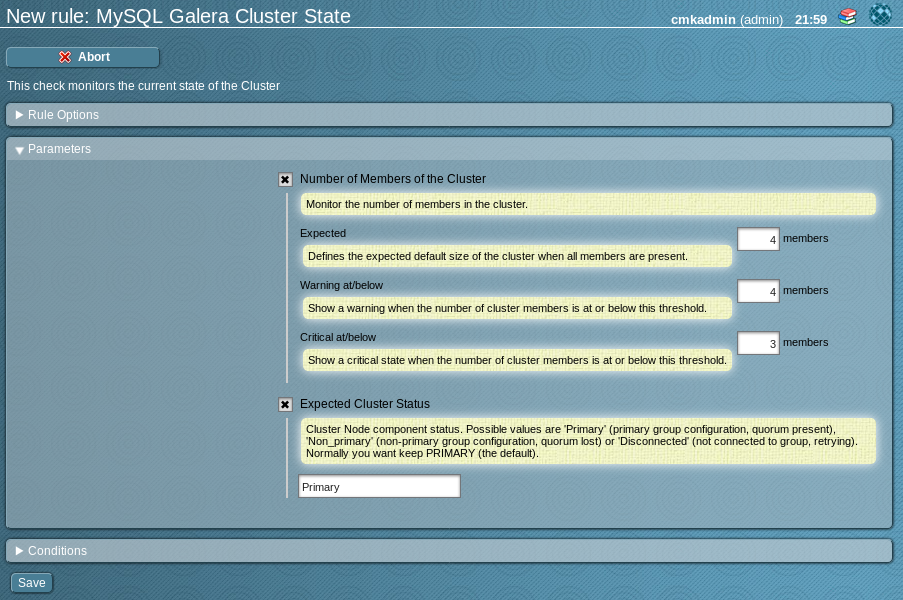
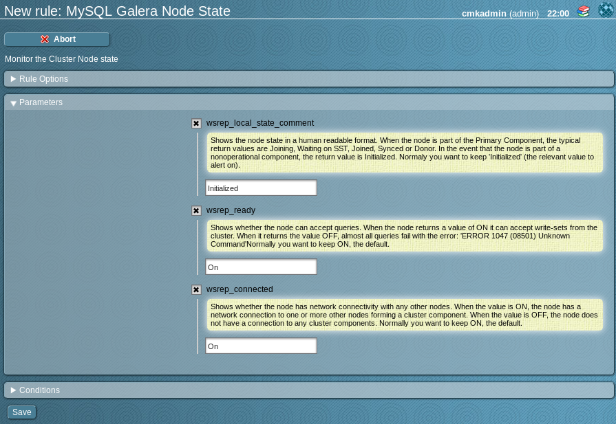
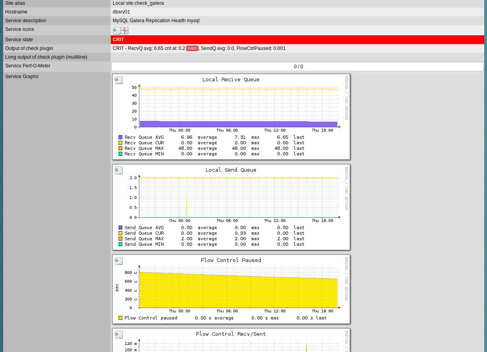
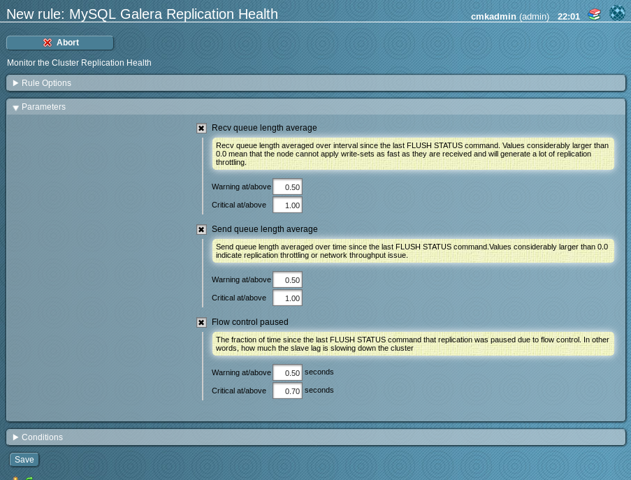

# check_mk-mysql_galera_cluster
A Check_MK plugin for checking the status of a galera cluster (based on http://galeracluster.com/documentation-webpages/monitoringthecluster.html)

The check parases the mysql output of the standard check_mk_agent for the presence of specific wsrep variables and status lines.



It will provide three single checks with WATO integration:

<!-- TOC depthFrom:2 depthTo:2 withLinks:1 updateOnSave:1 orderedList:0 -->

- [MySQL Galera Cluster State](#mysql-galera-cluster-state)
- [MySQL Galera Node State](#mysql-galera-node-state)
- [MySQL Galera Replication Health](#mysql-galera-replication-health)

<!-- /TOC -->




License: [GPLv2](LICENSE)

## MySQL Galera Cluster State

The check shows information about the general Cluster state:

* `Size` - The current size of the cluster and the expected size configured in WATO
* `Status` - The current status of the cluster
* `ConfID` - Show the number of Cluster Changes and should be the same for all Cluster Nodes.
* `Cluster UUID` - shows the current UUID and should be the same for all Members of the Cluster


__WATO integration__


In the WATO you have the possibility to define:

___Number of Members of the Cluster___
* `expected` - the number of nodes the cluster normaly has
* `warning threshold` - a warning alert will be thrown when the number of members is below this number
* `critical threshold` - - a cirtical alert will be thrown when the number of members is below this number

___Expected Cluster Status___
* Defines the status of the node. This defaults to "Primary" and it normaly doesn't make sense to change this. Any value other than primary will indicate problems with the cluster.


## MySQL Galera Node State

The check shows information about the node state:

* `Ready` - shows if the node is ready for accept write-sets from the cluster
* `Connected` - shows if the node has network connectivity with any other nodes.
* `State` - shows if the node is a operational part of the cluster

__WATO integration__


In the WATO you have the possibility to define:

***wsrep_local_state_comment***
* Shows the node state in a human readable format. When the node is part of the Primary Component, the typical return values are Joining, Waiting on SST, Joined, Synced or Donor. In the event that the node is part of a nonoperational component, the return value is Initialized. Normaly you want to keep 'Initialized' (the relevant value to alert on).

***wsrep_ready***
* Shows whether the node can accept queries. When the node returns a value of ON it can accept write-sets from the cluster. When it returns the value OFF, almost all queries fail with the error: 'ERROR 1047 (08501) Unknown Command'Normally you want to keep ON, the default.

***wsrep_connected***
* Shows whether the node has network connectivity with any other nodes. When the value is ON, the node has a network connection to one or more other nodes forming a cluster component. When the value is OFF, the node does not have a connection to any cluster components. Normally you want to keep ON, the default.

## MySQL Galera Replication Health

The check shows information about the performance of the cluster node member and can give hints to identify performance problems.



The check shows information about the replication performance of a node:

___Receive Queue___
* `Recv Queue AVG` - Shows the average size of the local received queue since the last status query.
* `Recv Queue CUR` - Current (instantaneous) length of the recv queue.
* `Recv Queue MAX` - The maximum length of the recv queue since the last FLUSH STATUS command.
* `Recv Queue MIN` - The minimum length of the recv queue since the last FLUSH STATUS command.

___Send Queue___
* `Send Queue AVG` - Show an average for the send queue length since the last FLUSH STATUS query.
* `Send Queue CUR` - Current (instantaneous) length of the send queue.
* `Send Queue MAX` - The maximum length of the send queue since the last FLUSH STATUS command.
* `Send Queue MIN` - The minimum length of the send queue since the last FLUSH STATUS command.

___Flow Control___
* `Flow Control Recv` -  Returns the number of FC_PAUSE events the node has received, including those the node has sent.
* `Flow Control Sent` - Returns the number of FC_PAUSE events the node has sent
* `Flow Control paused` - Shows the fraction of the time, since FLUSH STATUS was last called, that the node paused due to Flow Control.

___Cert deps distance___

Shows the average distance between the lowest and highest sequence number, or seqno, values that the node can possibly apply in parallel. This represents the node’s potential degree for parallelization. In other words, the optimal value you can use with the wsrep_slave_threads parameter, given that there is no reason to assign more slave threads than transactions you can apply in parallel.


__WATO integration__


In the WATO you have the possibility to define:

***Recv queue length average***
* shows the average size of the local received queue since the last status query.
* When the node returns a value higher than 0.0 it means that the node cannot apply write-sets as fast as it receives them, which can lead to replication throttling.
* you can define warning and critical thresholds to alert a node causing replication throttling

***Send queue length average***
* show an average for the send queue length since the last FLUSH STATUS query.
* Values much greater than 0.0 indicate replication throttling or network throughput issues, such as a bottleneck on the network link. The problem can occur at any layer from the physical components of your server to the configuration of the operating system.
* you can define warning and critical thresholds to alert a node with network
 throughput problems


***Flow control paused***
* shows the fraction of the time, since FLUSH STATUS was last called, that the node paused due to Flow Control.
* When the node returns a value of 0.0, it indicates that the node did not pause due to Flow Control during this period. When the node returns a value of 1.0, it indicates that the node spent the entire period paused. If the time between FLUSH STATUS and SHOW STATUS was one minute and the node returned 0.25, it indicates that the node was paused for a total 15 seconds over that time period.
* Ideally, the return value should stay as close to 0.0 as possible, since this means the node is not falling behind the cluster. In the event that you find that the node is pausing frequently, you can adjust the wsrep_slave_threads parameter or you can exclude the node from the cluster.


# Contributing
1. Create a personal fork of the project on Github.
2. Clone the fork on your local machine. Your remote repo on Github is called ```origin```.
3. Add the original repository as a remote called ```upstream```.
4. If you created your fork a while ago be sure to pull upstream changes into your local repository.
5. Create a new branch to work on!
6. Implement/fix your feature, comment your code.
7. Add or change the documentation as needed.
8. Push your branch to your fork on Github, the remote ```origin```.
9. From your fork create a pull request to the ```master``` branch.
